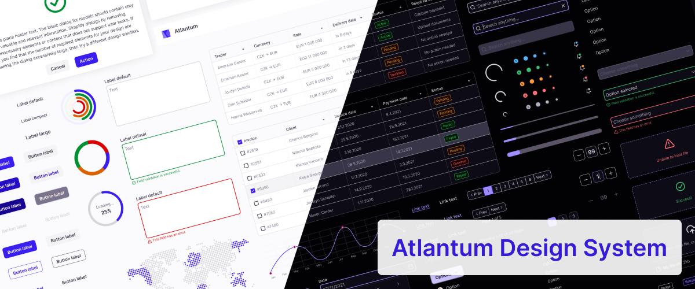

# Atlantum UI starting template



### Hello, this is template repository for quick start building UI components based on Awesome Antlantum Design System Figma UI Kit, which you can get <a href="https://app.gumroad.com/arturivanov">here</a>.

## Template includes:

-   Defined and transformed tokens to Default (Light) and Dark themes.
-   Defined publishable component library with example Button component to show how theming works.
-   Defined storybook with example Button component.

## How it builds.

-   Entire repository are based on great NX tool. This tool allows your team build and maintain large apps or libraries. More info <a href="https://nx.dev">here</a>.
-   Library are based on React with Typescript.
-   Styling made by one of the most popular CSS in JS library Styled Components, you can read about this library <a href="https://styled-components.com">here</a>.

## Project structure

```
  ___ project root
  |__ packages (root derictory for libraris)
  |   |___ components (main folder for react UI library) - this is publishable library for NPM
  |   |___ theme (main folder for storing design tokens, themes) - this is publishable library for NPM
  |____ ...
```

## Useful commands

-   Generate new library inside project

```shell
  # Generate new library inside project
  # https://nx.dev/react/library
  nx g @nrwl/react:library library-name --publishable --importPath=@my-org/library-name
```

-   Generate new component inside app or library

```shell
  # Generate new component inside app or library
  # https://nx.dev/react/component
  nx g @nrwl/react:component component-name --project=project-name
```

-   Using storybook with React

```shell
  # Using storybook with React
  # https://nx.dev/storybook/overview-react
```

```shell
  # auto generate stories for components library
  nx g @nrwl/react:stories --components
```

```shell
  # Run Storybook dev
  nx run components:storybook
```
